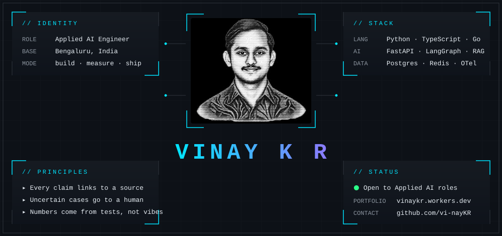
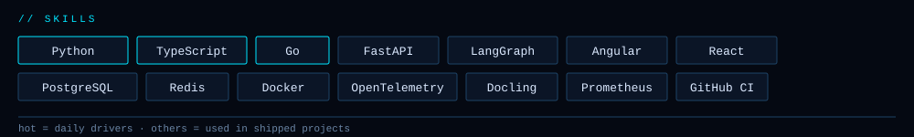

[**Portfolio**](https://portfolio.vinaykr.workers.dev/) &nbsp;·&nbsp;
[**Résumé**](https://portfolio.vinaykr.workers.dev/resumes/vinay_kr_resume_ats.pdf) &nbsp;·&nbsp;
[**LinkedIn**](https://linkedin.com/in/vi-naykr) &nbsp;·&nbsp;
[**Email**](mailto:vinayravindranatha@gmail.com)

I build AI systems that show their work: every extracted value links back to its
source, uncertain cases go to a person, and the backend underneath is boring and reliable.

<table>
<tr>
<td width="33%" valign="top">

**[ReconcileAI](https://github.com/vi-nayKR/multimodal-document-intelligence)** 
Invoice ⇄ PO review. Typed extraction, decimal reconciliation, source evidence, correction history.  
`Python` `Docling` `Gemini` `FastAPI`

</td>
<td width="33%" valign="top">

**[FastAPI Agent Patterns](https://github.com/vi-nayKR/fastapi-genai-agent-patterns)** 
Agent workflows with human approval, SSE streaming, Redis caching, OpenTelemetry and a fixture eval.  
`LangGraph` `FastAPI` `Redis` `OTel`

</td>
<td width="33%" valign="top">

**[Homelab SRE Observability](https://github.com/vi-nayKR/homelab-sre-observability)** 
Go service with Prometheus SLOs, Grafana dashboards, Alertmanager and black-box probes.  
`Go` `Prometheus` `Grafana`

</td>
</tr>
</table>

| Eval discipline | Deterministic fixtures today; **live-model held-out eval for ReconcileAI is in progress** |
| Real product work | Co-built the backend at Medha Innovations — [architecture write-up](https://github.com/medha-innovations/engineering-showcase) |

Medha Innovations · digital-asset custody · regulated gaming.
Co-author, [*Data Visualisation of Time Tradable Assets Using Machine Learning*](https://doi.org/10.1109/NMITCON58196.2023.10275962), IEEE NMITCON 2023.

`open to applied AI & AI product engineering roles` &nbsp;·&nbsp; [say hi](mailto:vinayravindranatha@gmail.com)

